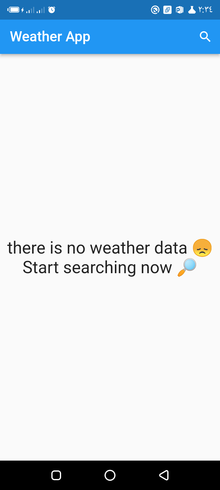
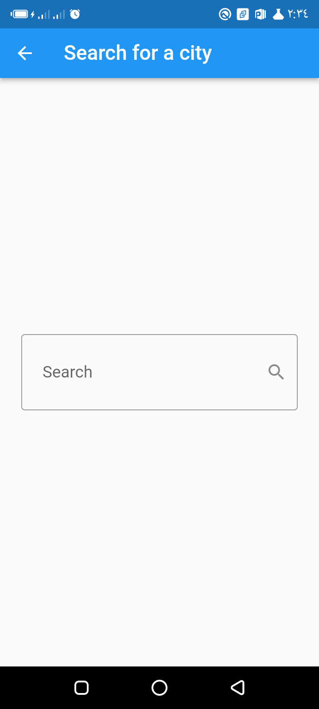
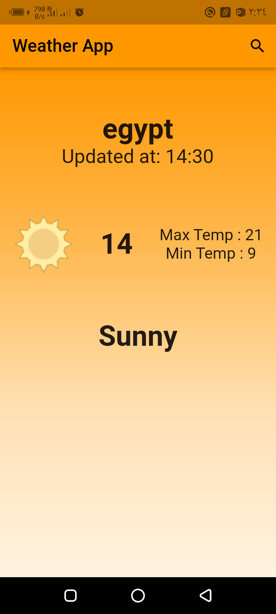
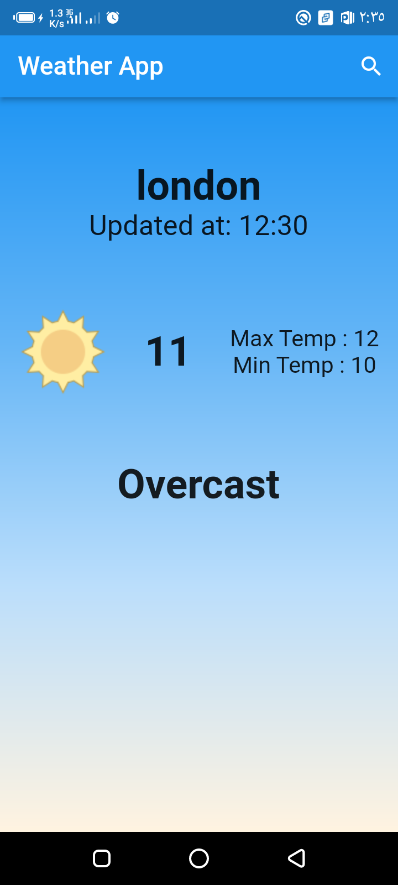

# weather_app

A new Flutter project from instructor [Tharwat Samy](https://www.youtube.com/@tharwatsamy/featured).

This is a nice little project from his [udemy course](https://www.udemy.com/course/best-and-complete-flutter-course-for-beginners/)

## Images of the application are below

#### No Data Screen

#### Search Screen

#### Sunny Screen

#### Cold Screen

